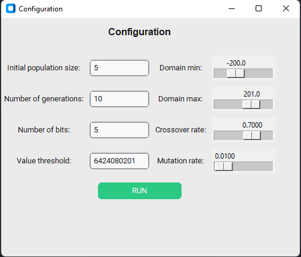

# Genetic Algorithm Optimization

## Introduction

This project implements a genetic algorithm optimization technique in Python that maximizes the function $4 \cdot x^4 + 3 \cdot x^3 + 2 \cdot x^2 + x^1 + 1$. 

## Technical


A genetic algorithm is a powerful optimization technique inspired by the process of natural selection and genetics. It's designed to find solutions to optimization and search problems by mimicking the principles of biological evolution. At its core, a genetic algorithm operates on a population of candidate solutions, represented as individuals or chromosomes, which undergo a process of evolution over generations to improve their fitness.

In the context of maximizing functions, a genetic algorithm aims to find the input parameters or configurations that produce the maximum output value of a given function, often referred to as the objective function or fitness function. Each individual in the population represents a potential solution to the optimization problem, and its fitness is evaluated based on how well it performs according to the objective function. The genetic algorithm then iteratively explores the search space, selecting individuals with higher fitness to serve as parents for producing offspring through genetic operations such as crossover and mutation.

Through these genetic operations, the algorithm introduces variations and explores new regions of the search space, gradually improving the population's overall fitness over generations. As the algorithm progresses, individuals with higher fitness become more prevalent in the population, leading to the convergence towards the optimal solution.

## Technologies used

* Python: Python was chosen as the primary programming language for this project due to its ease of use, extensive libraries, and fast development workflow. Python's simplicity and readability make it an ideal choice for implementing complex algorithms like genetic algorithms. Additionally, the vast ecosystem of libraries in Python provides powerful tools for numerical computation, data visualization, and algorithmic optimization, facilitating efficient implementation and experimentation.
  
* Tkinter & Custom Tkinter: For the user interface, I used Tkinter (no so much) and Custom Thinker. While Tkinter provides a solid foundation for creating graphical user interfaces in Python, customizing its appearance and behavior to align with specific project requirements can be time-consuming and labor-intensive. By leveraging custom Tkinter themes and components, I was able to streamline the development process and achieve a visually appealing interface that enhances user engagement.

* Manim: Manim (Mathematical Animation Engine) is a powerful Python library for creating animations, particularly suited for mathematical and scientific visualization. The decision to incorporate Manim into the project was driven by the desire to visualize the genetic algorithm's operations and results in a clear and engaging manner. By leveraging Manim's capabilities, the project aims to provide visual insights into how the genetic algorithm progresses through generations, how candidate solutions evolve, and how the fitness landscape changes over time.

	Here you can see the graph of the function animated using manim:

	<details>
	<summary>Function Graph</summary>
		<video controls src="out/FunctionAnimation.mp4" title="Title"></video>
	</details>


## Project structure

For managing the python packages I used a virtual environment which is added to .gitignore.
The project's entry point is the user_interface.py file which opens a small window designed using Custom Thinker. 

<details>
<summary>Code Snippet</summary>

```python
import tkinter as tk
from customtkinter import (
    CTk,
    CTkButton,
    CTkEntry,
    CTkLabel,
    set_appearance_mode,
    set_default_color_theme,
)

from main import *
from constants import *

set_appearance_mode("System")
set_default_color_theme("green")


class App(CTk):
    def __init__(self, *args, **kwargs):
        super().__init__(*args, **kwargs)

        self.title("Configuration")
        self.geometry("500x400")

        self.title_label = CTkLabel(
            self, text="Configuration", font=("Helvetica", 16, "bold")
        )
        self.title_label.grid(row=0, column=0, columnspan=4, pady=(10, 20))

        self.initial_population_size_label = CTkLabel(
            self, text="Initial population size:"
        )
        self.initial_population_size_label.grid(row=1, column=0, padx=5, pady=5)
        self.initial_population_size_input = CTkEntry(self, width=100)
        self.initial_population_size_input.grid(row=1, column=1, padx=5, pady=5)
        self.initial_population_size_input.insert(0, str(INITIAL_POPULATION_SIZE))

        self.number_of_generations_label = CTkLabel(self, text="Number of generations:")
        self.number_of_generations_label.grid(row=2, column=0, padx=5, pady=5)
        self.number_of_generations_input = CTkEntry(self, width=100)
        self.number_of_generations_input.grid(row=2, column=1, padx=5, pady=5)
        self.number_of_generations_input.insert(0, str(NUMBER_OF_GENERATIONS))

        self.number_of_bits_label = CTkLabel(self, text="Number of bits:")
        self.number_of_bits_label.grid(row=3, column=0, padx=5, pady=5)
        self.number_of_bits_input = CTkEntry(self, width=100)
        self.number_of_bits_input.grid(row=3, column=1, padx=5, pady=5)
        self.number_of_bits_input.insert(0, str(NUMBER_OF_BITS))

        self.value_threshold_label = CTkLabel(self, text="Value threshold:")
        self.value_threshold_label.grid(row=4, column=0, padx=5, pady=5)
        self.value_threshold_input = CTkEntry(self, width=100)
        self.value_threshold_input.grid(row=4, column=1, padx=5, pady=5)
        self.value_threshold_input.insert(0, str(VALUE_THRESHOLD))

        self.domain_min_label = CTkLabel(self, text="Domain min:")
        self.domain_min_label.grid(row=1, column=2, padx=5, pady=5)
        self.domain_min_slider = tk.Scale(
            self, from_=-500, to=450, resolution=0.1, orient=tk.HORIZONTAL
        )
        self.domain_min_slider.set(FUNCTION_DOMAIN["MIN"])
        self.domain_min_slider.grid(row=1, column=3, padx=5, pady=5)

        self.domain_max_label = CTkLabel(self, text="Domain max:")
        self.domain_max_label.grid(row=2, column=2, padx=5, pady=5)
        self.domain_max_slider = tk.Scale(
            self, from_=-450, to=500, resolution=0.1, orient=tk.HORIZONTAL
        )
        self.domain_max_slider.set(FUNCTION_DOMAIN["MAX"])
        self.domain_max_slider.grid(row=2, column=3, padx=5, pady=5)

        self.crossover_rate_label = CTkLabel(self, text="Crossover rate:")
        self.crossover_rate_label.grid(row=3, column=2, padx=5, pady=5)
        self.crossover_rate_slider = tk.Scale(
            self, from_=0, to=1, resolution=0.0001, orient=tk.HORIZONTAL
        )
        self.crossover_rate_slider.set(CROSSOVER_RATE)
        self.crossover_rate_slider.grid(row=3, column=3, padx=5, pady=5)

        self.mutation_rate_label = CTkLabel(self, text="Mutation rate:")
        self.mutation_rate_label.grid(row=4, column=2, padx=5, pady=5)
        self.mutation_rate_slider = tk.Scale(
            self, from_=0, to=1, resolution=0.0001, orient=tk.HORIZONTAL
        )
        self.mutation_rate_slider.set(MUTATION_RATE)
        self.mutation_rate_slider.grid(row=4, column=3, padx=5, pady=5)

        self.button = CTkButton(self, text="RUN", command=self.on_button_click)
        self.button.grid(row=5, column=0, columnspan=4, pady=10)

    def on_button_click(self):
        text_input_values = [
            self.initial_population_size_input.get(),
            self.number_of_generations_input.get(),
            self.number_of_bits_input.get(),
            self.value_threshold_input.get(),
        ]

        slider_values = [
            self.domain_min_slider.get(),
            self.domain_max_slider.get(),
            self.crossover_rate_slider.get(),
            self.mutation_rate_slider.get(),
        ]

        with open("logs/logs.txt", "w") as f:
            pass

        result = run_genetic_algorithm(
            int(text_input_values[0]),
            int(text_input_values[1]),
            slider_values[0],
            slider_values[1],
            int(text_input_values[2]),
            slider_values[2],
            slider_values[3],
            float(text_input_values[3]),
        )


if __name__ == "__main__":
    app = App()
    app.mainloop()

```

</details>


Here the user has the possibility to configure the algorithm's input values. The default values are extracted from the "constants.py" file.

<details>
<summary>User interface</summary>



</details>

The algorithm's steps data output is written in the "logs.txt" file from the logs folder.

The algorithm can also be run from the command line by running the main.py file.

<details>
<summary>Code Snippet</summary>

```python
def main():
    result = run_genetic_algorithm(
        INITIAL_POPULATION_SIZE,
        NUMBER_OF_GENERATIONS,
        FUNCTION_DOMAIN["MIN"],
        FUNCTION_DOMAIN["MAX"],
        NUMBER_OF_BITS,
        MUTATION_RATE,
        VALUE_THRESHOLD,
    )
    print(result)


main()
```

</details>

The "manim_utils.py" file is used to take the data by generation and send it to the animation class when the solution is found, if there is one.

<details>
<summary>Code Snippet</summary>

```python
from constants import *
from animations.generations import *

data = []


def add_generation_data(decoded_values, fitness_values, generation):
    data.append(tuple((decoded_values, fitness_values, generation)))


def generate_animation():
    play_animation(data)
```
</details>

The animation class is found in the "generations.py" file inside the animations folder. Here the data is processed and then placed inside a table which is rendered.

<details>
<summary>Code Snippet</summary>

```python
from manim import *
import numpy as np
from statistics import mean
from constants import *


class GenerationsAnimation(Scene):
    def __init__(self, data):
        super().__init__()
        self.data = data

    def construct(self):
        rows = []
        row_labels = []

        for i in range(len(self.data)):
            generation_data = self.data[i]
            generation_fitness_sum = sum(generation_data[1])
            generation_fitness_average = mean(generation_data[1])
            generation_maximum_x = generation_data[0][0]
            generation_maximum_y = generation_data[1][0]
            rows.append(
                [
                    str(i + 1),
                    str(generation_fitness_sum),
                    str(generation_fitness_average),
                    str(generation_maximum_y),
                ]
            )
            row_labels.append(i)

        table = Table(
            rows,
            col_labels=[
                Text("Generation"),
                Text("Sum"),
                Text("Average"),
                Text("Maximum"),
            ],
            include_outer_lines=True,
        ).set_column_colors(RED, GREEN, PURPLE, BLUE)
        table = table.scale(0.5)
        self.play(Write(Tex("Fitness Statistics by Generation").to_edge(edge=UP)))
        self.play(Write(table))
        self.wait(2)


def play_animation(data):
    animation = GenerationsAnimation(data)
    animation.render()
```
</details>

## Algorithm

The algorithm is implemented in 10 steps:

1. Select a random initial population from the function chosen domain, encoded in binary, into a finite length string
   
<details>
<summary>Code Snippet</summary>

```python
def select_initial_population(size, a, b, number_of_bits):
    population = []
    for i in range(size):
        population.append(binary_encode(random.uniform(a, b), a, b, number_of_bits))
    return population
```

</details>


2. Decoded the values for population generated
   

<details>
<summary>Code Snippet</summary>

```python
def binary_decode(encoded_string, a, b, number_of_bits):
    decoded_number = int(encoded_string, 2)
    decoded_number = decoded_number / (2**number_of_bits - 1) * (b - a) + a
    return decoded_number
```

</details>


3. Calculate the fitness for the decoded values
   
<details>
<summary>Code Snippet</summary>

```python
def compute_fitness(x):
    return 4 * x**4 + 3 * x**3 + 2 * x**2 + x + 1

def compute_fitness_for_population(arguments):
    fitness = []
    for i in range(len(arguments)):
        fitness.append(compute_fitness(arguments[i]))
    return fitness
```

</details>

4. Compute the probability of selection for the population

   This is calculated using the following formula: 
   
   $P_i$ = $\frac{f(x)_i}{\sum_{k=1}^{n}f(x)_k}$

   Where  $f(x)_i$ is the fitness of the member i of the population

<details>
<summary>Code Snippet</summary>

```python
def compute_probability_of_selection(fitness):
    fitness_sum = sum(fitness)
    probability = []
    for i in range(len(fitness)):
        probability.append(fitness[i] / fitness_sum)
    return probability

```

</details>

5. Calculate the expected count

   The expected count provides insight into which population may be chosen for additional consideration in the mating pool. We calculate it using the following formula:
   
   $E_i$ = $\frac{f(x)_i}{\frac{\sum_{k=1}^{n}f(x)_k}{n}}$
   i.e. Expected count = $\frac{Fitness}{\text{Fitness Average}}$

<details>
<summary>Code Snippet</summary>

```python
def compute_expected_count(fitness):
    average_fitness = mean(fitness)
    expected_count = []
    for i in range(len(fitness)):
        expected_count.append(fitness[i] / average_fitness)
    return expected_count

```

</details>

6. Compute the actual count used for selecting the individuals which would
participate in the crossover cycle using Roulette wheel selection

<details>
<summary>Code Snippet</summary>

```python
    actual_count = [0] * len(probability)
    number_of_spins = INITIAL_POPULATION_SIZE * 2

    for _ in range(number_of_spins):
        spin_result = random.random()
        cumulative_prob = 0
        for i, prob in enumerate(probability):
            cumulative_prob += prob
            if spin_result <= cumulative_prob:
                actual_count[i] += 1
                break
    return actual_count

```

</details>

7. Crossover operation is performed to produce new offspring (children).
   
<details>
<summary>Code Snippet</summary>

```python
def create_offspring(
    population,
    first_parent_index,
    second_parent_index,
    number_of_bits,
):
    crossover_point = random.randint(1, number_of_bits - 1)
    first_offspring = (
        population[first_parent_index][0][:crossover_point]
        + population[second_parent_index][0][crossover_point:]
    )

    second_offspring = (
        population[second_parent_index][0][:crossover_point]
        + population[first_parent_index][0][crossover_point:]
    )

    return first_offspring, second_offspring


def do_crossover(
    sorted_population,
    number_of_bits,
):
    population_copy = sorted_population
    descendants = []

    i = 0
    j = 1
    # print(population_copy)
    while j < len(sorted_population):
        first_descendant, second_descendant = create_offspring(
            population_copy,
            i,
            j,
            number_of_bits,
        )
        descendants.append(first_descendant)
        descendants.append(second_descendant)

        first_parent = list(population_copy[i])
        second_parent = list(population_copy[j])

        first_parent[4] = first_parent[4] - 1  # decrease actual count
        second_parent[4] = second_parent[4] - 1  # decrease actual count

        population_copy[i] = tuple(first_parent)
        population_copy[j] = tuple(second_parent)

        if population_copy[i][4] == 0:
            if population_copy[j][4] == 0:
                i = i + 2
                j = j + 2
            else:
                i = i + 1
                j = j + 1
        else:
            if population_copy[j][4] == 0:
                j = j + 1
    return descendants
```

</details>


8.   Based on a mutation probability (which in my case is the default 0.01), mutations are introduced into the chromosomes offspring at randomly chosen positions

<details>
<summary>Code Snippet</summary>

```python
def do_mutation(descendants, domain_min, domain_max, number_of_bits, mutation_rate):
    mutated_descendants = []

    for i in range(len(descendants)):
        if random.random() < mutation_rate:
            mutation_index = random.randint(0, number_of_bits - 1)
            encoded_value = descendants[i]
            mutated_value = (
                encoded_value[:mutation_index]
                + ("1" if encoded_value[mutation_index] == "0" else "0")
                + encoded_value[mutation_index + 1 :]
            )
            mutated_descendants.append(mutated_value)
        else:
            mutated_descendants.append(descendants[i])
    return mutated_descendants

```

</details>

9.   The mutated descendants become the new population and the cycle is repeated until the maximum fitness is larger than a specific threshold. If that doesn't happen, the final result will be the last generation.


<details>
<summary>Code Snippet</summary>

```python
def do_mutation(descendants, domain_min, domain_max, number_of_bits, mutation_rate):
    mutated_descendants = []

    for i in range(len(descendants)):
        if random.random() < mutation_rate:
            mutation_index = random.randint(0, number_of_bits - 1)
            encoded_value = descendants[i]
            mutated_value = (
                encoded_value[:mutation_index]
                + ("1" if encoded_value[mutation_index] == "0" else "0")
                + encoded_value[mutation_index + 1 :]
            )
            mutated_descendants.append(mutated_value)
        else:
            mutated_descendants.append(descendants[i])
    return mutated_descendants

```

</details>

## Tests

1. 

```python
INITIAL_POPULATION_SIZE = 5
NUMBER_OF_GENERATIONS = 10
FUNCTION_DOMAIN = {"MIN": -200, "MAX": 201}
NUMBER_OF_BITS = 5
CROSSOVER_RATE = 0.7
MUTATION_RATE = 0.01
VALUE_THRESHOLD = 6424080201
```

<details>
<summary>Data</summary>
	<video controls src="tests/test-1.mp4" title="Title"></video>
</details>


1. 

```python
INITIAL_POPULATION_SIZE = 4
NUMBER_OF_GENERATIONS = 10
FUNCTION_DOMAIN = {"MIN": -10, "MAX": 11}
NUMBER_OF_BITS = 5
CROSSOVER_RATE = 0.7
MUTATION_RATE = 0.01
VALUE_THRESHOLD = 35000
```

<details>
 <summary>Data</summary>
	<video controls src="tests/test-2.mp4" title="Title"></video>
</details>


3. 

```python
INITIAL_POPULATION_SIZE = 4
NUMBER_OF_GENERATIONS = 3
FUNCTION_DOMAIN = {"MIN": -10, "MAX": 11}
NUMBER_OF_BITS = 5
CROSSOVER_RATE = 0.7
MUTATION_RATE = 0.01
VALUE_THRESHOLD = 350000
```

<details>
<summary>Result</summary>

```txt
Generation:  1
Encoded population:  ['00000', '01000', '10000', '11100']
Decoded population:  [-10.0, -4.580645161290323, 0.8387096774193541, 8.967741935483872]
Sorted population based on fitness:  [('00000', -10.0, 37191.0, 0.5558095566882887, 3), ('11100', 8.967741935483872, 28204.13658920589, 0.4215032845156749, 5)]
Generation:  2
Encoded population:  ['00000', '11100', '00000', '11100', '00100', '11000']
Decoded population:  [-10.0, 8.967741935483872, -10.0, 8.967741935483872, -7.290322580645162, 6.258064516129032]
Sorted population based on fitness:  [('00000', -10.0, 37191.0, 0.25131945914054915, 2), ('00000', -10.0, 37191.0, 0.25131945914054915, 3), ('11100', 8.967741935483872, 28204.13658920589, 0.19059042115365, 4), ('11100', 8.967741935483872, 28204.13658920589, 0.19059042115365, 1), ('00100', -7.290322580645162, 10236.7727025157, 0.06917534293084304, 2)]
Generation:  3
Encoded population:  ['00000', '00000', '00000', '00000', '01100', '10000', '11100', '11100', '11100', '00100', '11100', '00100']
Decoded population:  [-10.0, -10.0, -10.0, -10.0, -1.870967741935484, 0.8387096774193541, 8.967741935483872, 8.967741935483872, 8.967741935483872, -7.290322580645162, 8.967741935483872, -7.290322580645162]
Sorted population based on fitness:  [('00000', -10.0, 37191.0, 0.13183782515306292, 4), ('00000', -10.0, 37191.0, 0.13183782515306292, 3), ('00000', -10.0, 37191.0, 0.13183782515306292, 2), ('00000', -10.0, 37191.0, 0.13183782515306292, 1), ('11100', 8.967741935483872, 28204.13658920589, 0.09998042613107552, 2), ('11100', 8.967741935483872, 28204.13658920589, 0.09998042613107552, 3), ('11100', 8.967741935483872, 28204.13658920589, 0.09998042613107552, 3), ('11100', 8.967741935483872, 28204.13658920589, 0.09998042613107552, 3), ('00100', -7.290322580645162, 10236.7727025157, 0.036288183960794605, 2), ('00100', -7.290322580645162, 10236.7727025157, 0.036288183960794605, 1)]
Could not reach the threshold value! Try other configurations! Here are the final fitness values: 
```

</details>

# Bibliography


[Introduction to Genetic Algorithms by S.N. Sivanandam, S.N. Deepa](<doc/Introduction to Genetic Algorithms, Springer.pdf>)